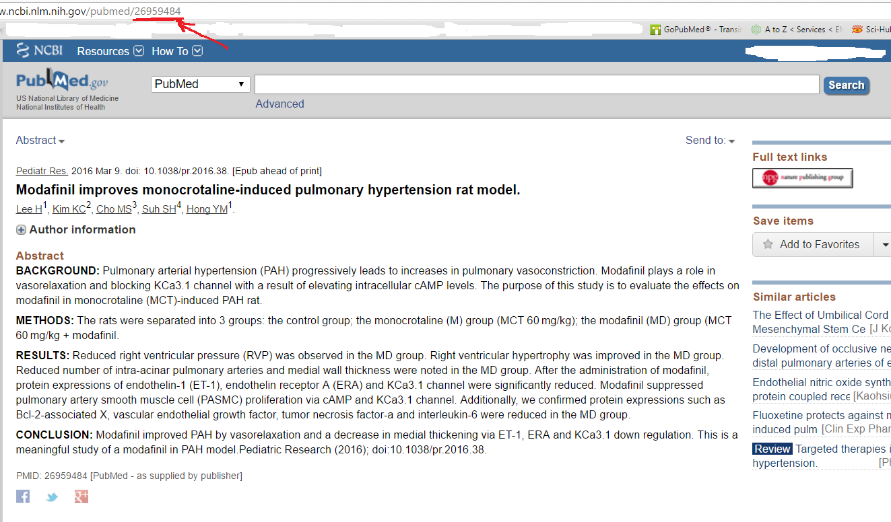

# PubMed-Replace-w-SMW

PubMed has millions of abstracts, but they aren't easy for the average person to read/understand.
I've been privately "translating" to layman's terms ones that interest me, and I know other people who do the same. This is an expieremental prototype that will maybe lead to compiling our translations.

## Default pubmed abstract.

## Create a page with the same number in you semantic mediawiki.

## Reload pubmed page.

## Ignore my description of the abstract. It was just thrown together for the example. I'm not in medicine/biology.
